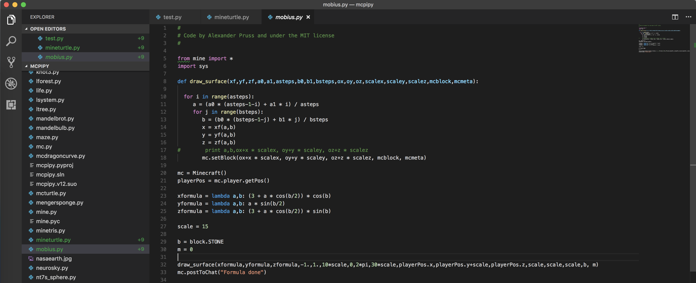

Quick Manual
====

Installation
---

**Windows**

1. Install Minecraft from [this link](https://minecraft.net/pl-pl/download/)
2. Install [MinecraftForge](https://files.minecraftforge.net/) (download an installer of recommended version).
3. After the installation you should see a new Forge profile when running Minecraft. 
4. Close the game and install RasberryJamMod.
5. Download an installer from [here](https://github.com/arpruss/raspberryjammod/releases/download/0.94/RaspberryJamMod-Installer.exe) and start the installation.
.
6. After a successful installation now you need to install [Python for Windows](https://www.python.org/downloads/release/python-365/). Remember to check "Add python.exe to Path".
 
	

7. Use `Windows + R`shortcut and type `%appdata%\.minecraft`. You will open a hidden folder `minecraft`. Check if a `mods` folder is created. If yes, everything is fine. If not, you need to create a new folder callec `mods`.

	

8. Download a `mods.zip` file from [here](https://github.com/arpruss/raspberryjammod/releases/download/0.94/mods.zip) and unzip its content in `mods` folder.
9. Download `python-scripts.zip` from [here](https://github.com/arpruss/raspberryjammod/releases/download/0.94/python-scripts.zip). **Unzip it in `.minecraft` folder.**
10. After extracting, check if `mcpipy` folder exists. We will use it to run our new scripts. 

	
	

**MacOS**

1. Install Minecraft from [this link](https://minecraft.net/pl-pl/download/)
2. Install [MinecraftForge](https://files.minecraftforge.net/) (download an installer of recommended version).
3. When installing, choose a default folder (`Application Support/minecraft`).
4. After the installation, run Minecraft and choose Play Forge. When initialization is done, close the game.
5. Go to `cd ~/Library/“Application Support”/minecraft/mods`
6. Install mods for Python `wget https://github.com/arpruss/raspberryjammod/releases/download/0.94/mods.zip`
7. Unzip this mod in the `mods` folder: `unzip mods.zip`
8. Go up to `minecraft` folder and install python-scripts: `wget https://github.com/arpruss/raspberryjammod/releases/download/0.94/python-scripts.zip`
9. `unzip python-scripts.zip` in `minecraft folder`
10. All scripts should be placed in `minecraft/mcpipy` folder 

Running scripts
---
1. Run Minecraft
2. Choose Singleplayer --> Create New World --> Options:
	- Game Mode: **Creative** 
	- More World Options: 
	    - Generate Structures: **Off**
	    - World Type: **Superflat**
3. Run scripts inside the game:
   - Run a console by hitting `/` on the keyboard
   - type: `py name-of-your-script`

Code editor
---
VS Code which can be downloaded from [here](https://code.visualstudio.com/).

1. Install VS Code
2. Open the editor and then open a folder with all scripts `minecraft/mcpipy`. You should see a view like below:

3. The editor will ask you to install Python extension --> Agree on that.
4. Now you can code. 

