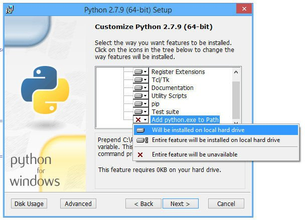
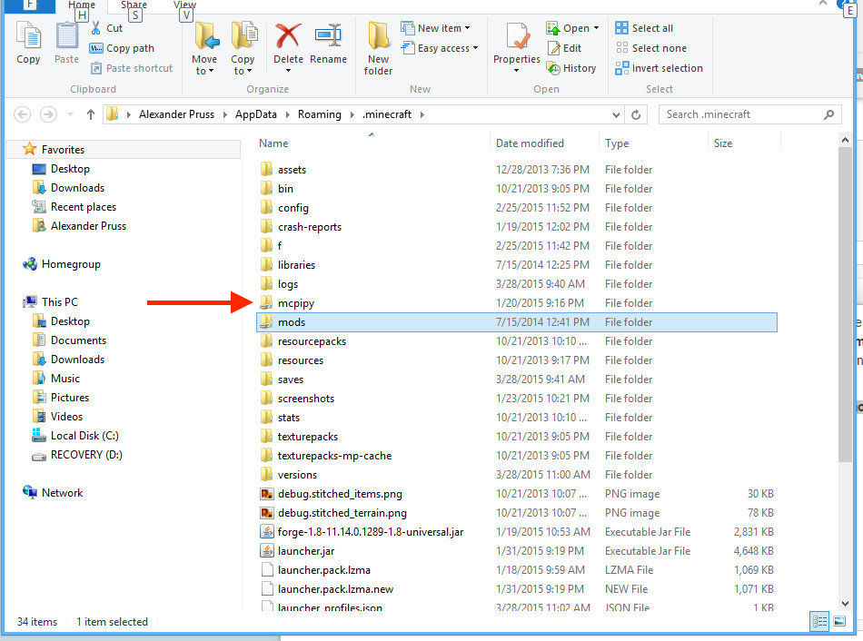

# Instrukcja Minecraft

* [Instalacja](#instalacja)
	* [Windows](#windows)
	* [MacOS](#macos)
* [Uruchamianie skryptów](#uruchamianie-skryptów)
* [Edytor kodu](#edytor-kodu)

## Instalacja

### Windows

1. Zainstaluj Minecrafta z [tego linka](https://minecraft.net/pl-pl/download/)
2. Zainstaluj następnie [MinecraftForge](https://files.minecraftforge.net/) (wybierz instalator zalecany (*Recommeneded*).
3. Po instalacji Forge i uruchomieniu Minecfrafta powinien sie pokazać nowy profil Forge.
4. Zamknij teraz grę i przejdź do instalacji RasberryJamMod.
5. Pobierz instalator [stąd](https://github.com/arpruss/raspberryjammod/releases/download/0.94/RaspberryJamMod-Installer.exe) i rozpocznij instalację.

	

6. Następnie zainstaluj [Python dla Windows](https://www.python.org/downloads/release/python-365/). Pamiętaj, aby zaznaczyć "Dodaj python.exe do ścieżki".

	

7. Naciśnij skrót `Windows + R` i wpisz `%appdata%\.minecraft`. Przejdziesz dzięki temu do ukrytego folderu `minecraft`. Sprawdź, czy znajduje się tam katalog `mods`. Jeśli tak, wszystko jest ok. Jeśli nie , musisz stworzyć nowy katalog o nazwie `mods`.

	

8. Ściągnij plik `mods.zip` [stąd](https://github.com/arpruss/raspberryjammod/releases/download/0.94/mods.zip) i wypakuj jego zawartość w katalogu `mods`.
9. Pobierz plik `python-scripts.zip` [stąd](https://github.com/arpruss/raspberryjammod/releases/download/0.94/python-scripts.zip). **Wypakuj go w katalogu `.minecraft`**.
10. Po wypakowaniu sprawdź czy pojawił się folder `mcpipy`. Do niego będziemy kopiować nasze nowe skrypty.

	

### MacOS

1. Zainstaluj Minecrafta z [tego linka](https://minecraft.net/pl-pl/download/)
2. Zainstaluj następnie [MinecraftForge](https://files.minecraftforge.net/) (wybierz instalator zalecany (*Recommeneded*).
3. Podczas instalacji MinecraftForge wybierz folder domyślny instalacji (`Application Support/minecraft`).
4. Po zainstalowaniu uruchom Minecrafta i wybierz Graj Forge (profil Forge powinien być stworzony). Kiedy inicjalizacja zostanie zakończona, wyłącz grę.
5. Używając terminala (iTerm) :) idź do katalogu (`cd ~/Library/"Application Support"/minecraft/mods`)
6. Pobierz moda dla Pythona używając komendy `wget https://github.com/arpruss/raspberryjammod/releases/download/0.94/mods.zip`. Jeśli nie masz wgeta, możesz je pobrać ręcznie i wrzucić do katalogu `mods`.
7. Wypakuj moda używając `unzip mods.zip` lub ręcznie.
8. Idź wyżej, do katalogu `minecraft` i zainstaluj `python-scripts`: `wget https://github.com/arpruss/raspberryjammod/releases/download/0.94/python-scripts.zip` (także możesz to zrobić ręcznie jak w pkt. 6).
9. Wypakuj skrypty w katalogu `minecraft`: `unzip python-scripts.zip`.
10. Sprawdź czy wszystkie skrypy są umieszczone w katalogu `minecraft/mcpipy`.

## Uruchamianie skryptów

1. Uruchom Minecrafta
2. Wybierz Tryb jednoosobowy --> Stwórz nowy świat --> Wybierz:
	- Tryb gry: **Kreatywny**
	
	- Więcej opcji świata:
	    - Generuj struktury: **Wył**
	    - Typ świata: **Super płaski**
	

3. Uruchom skrypt podczas gry:
   - Uruchom konsolę / terminal klikając `/` na klawiaturze
   - wpisz: `py twoj-skrypt`
   - **Aby w świecie Minecrafta ciągle panował dzień**, wejdź w konsolę i użyj komendy: `time set day`

## Edytor kodu

Będziemy używać **VS Code**, który można pobrać [stąd](https://code.visualstudio.com/).

1. Zainstaluj VS Code.
2. Otwórz edytor i następnie otwórz folder ze wszystkimi skryptami `minecraft/mcpipy`. Powinienieś zobaczyć widok jak poniżej.

3. Edytor zapyta, czy zainstalować rozszerzenie Python --> wyraź zgodę.
4. Możesz teraz przejść do kodowania.

